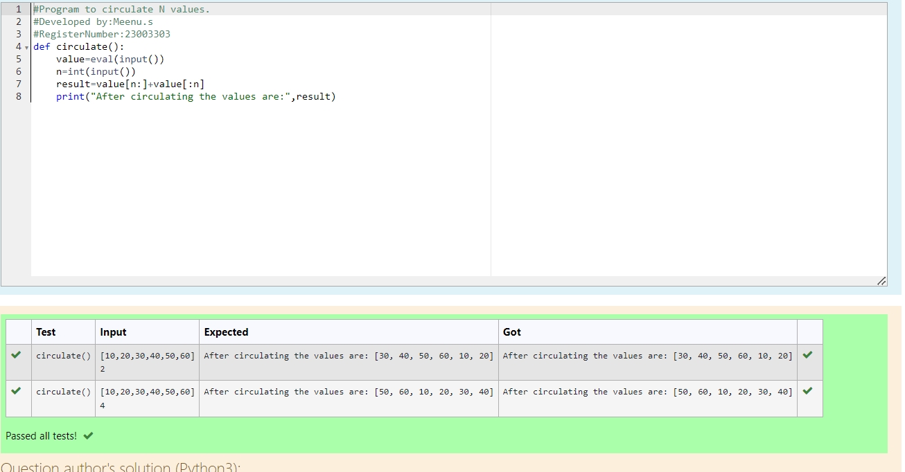

# Circulate the values of N variables
## Aim:
To write a python program to circulate the n variables using function concept
## Equipment’s required:
PC
Anaconda - Python 3.7
## Algorithm: 
### Step 1: 
Define a function calculate()
### Step 2: 
Assign a variable to get the list of values as input from the user
### Step 3: 
Get the value from the user for the number of rotation
### Step 4: 
Using the slicing concept rotate the list

### Step 5: 
Print the circulated list of values
### Step 6:
End the program 
## Program:
~~~
#Program to circulate N values.
#Developed by:Meenu.s 
#RegisterNumber:23003303
def circulate():
    value=eval(input()) 
    n=int(input())
    result=value[n:]+value[:n]
    print("After circulating the values are:",result)
~~~

## Output:

## Result:
Thus the python program to circulate n variables using function has been executed successfully.
